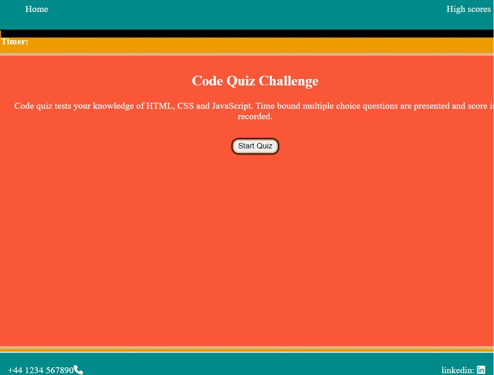
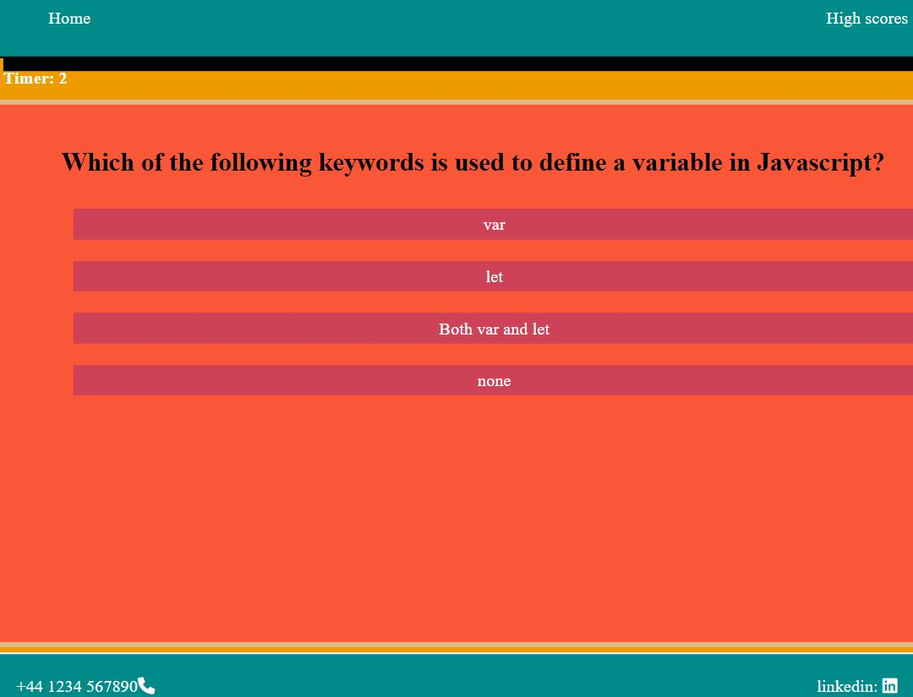
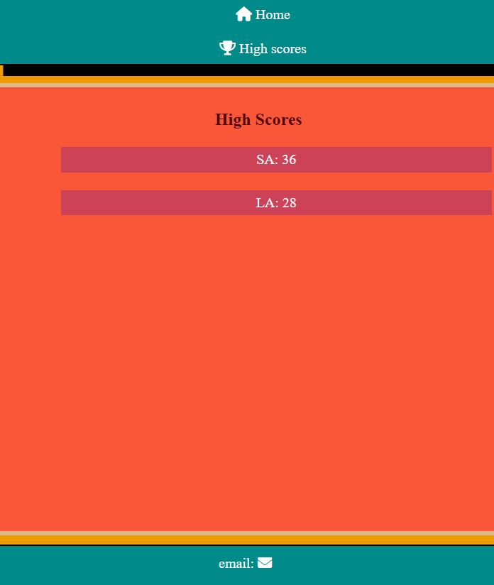

# code-quiz-homework# Web APIs: Code Quiz

## Link to deploy website [here](https://smeea-2018.github.io/code-quizz/)

## Task

The app is to builds a timed coding quiz with multiple-choice questions. This app will run in the browser and will feature dynamically updated HTML and CSS powered by JavaScript code . It will have a clean, polished, and responsive user interface.

## Description

The app creates a time-bound coding quiz with a set of multiple-choice question, high score board , focused DOM manipulation by using JavaScript to create a new section and remove current section from DOM and saving and retrieving score from local storage.

The code quiz-app allows you to take quiz. The app functions on any device either it is laptop or mobile. It features time-bound quiz with multiple choice questions, keeps track of your score you can compare your progress with peers, and socreboard.

## User Story

```
AS A user
I WANT to take a timed quiz on JavaScript fundamentals that stores high scores
SO THAT I can gauge my progress compared to my peers
```

## Acceptance Criteria

```
GIVEN I am taking a code quiz
WHEN I click the start button
THEN a timer starts and I am presented with a question
WHEN I answer a question
THEN I am presented with another question
WHEN I answer a question incorrectly
THEN time is subtracted from the clock
WHEN all questions are answered or the timer reaches 0
THEN the game is over
WHEN the game is over
THEN I can save my initials and my score
```

## Technologies

HTML to develop page structure
CSS to style the page
JavaScript to add functionality, dynamic behavior to the page and DOM manipulation.
DOM to create and remove a section
Local Storage to store the score

## Mock-Up

Following link provides the preview of the website.







## How to run and install the project

To run the project visual studio code, a web browser and git hub account is required. The code can be cloned by using git bash or github desktop. To clone code via git bash:

open git bash and navigate to folder where you want to

## Contact Information:

smeeaa131@gmail.com
